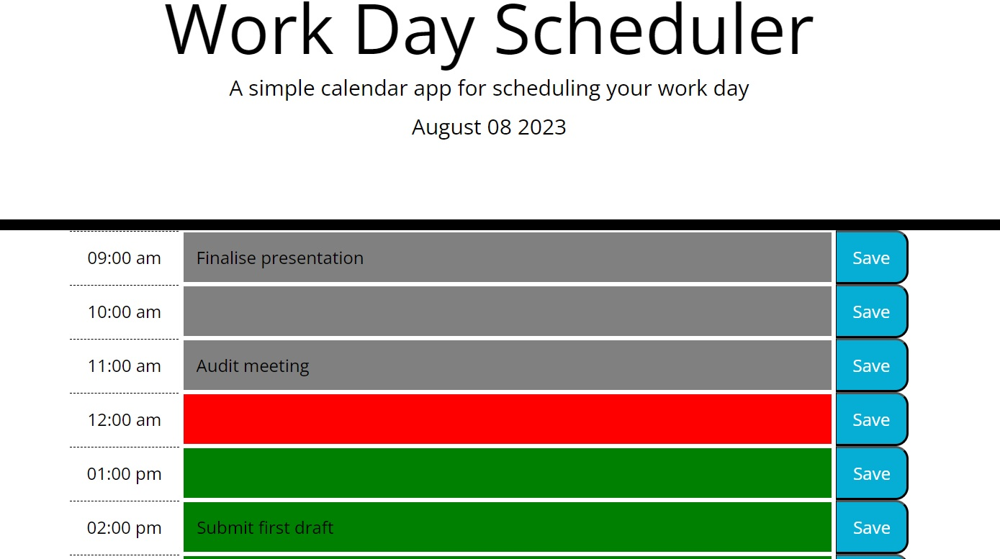

# Work-Day-Scheduler
A simple calendar application which allows employees to add events to their schedule to help them plan their day and manage time effectively

## Description

This calendar shows working hours from 9am to 5pm and busy employees can stay organised by scheduling their tasks into the different time blocks which
are colour coded grey, red and green to indicate
hours which have passed (grey), present (red) and green (future).

### Dependencies

None

### Project Link

https://sfsl06.github.io/Work-Day-Scheduler/

## Authors

Contributors names and contact info

Sabeen Faisal 
sabeenjamil100@yahoo.com

## Built with

HTML
CSS
Bootstrap
JQuery

## Acknowledgments

https://www.w3schools.com/css/
https://netninja.dev/courses